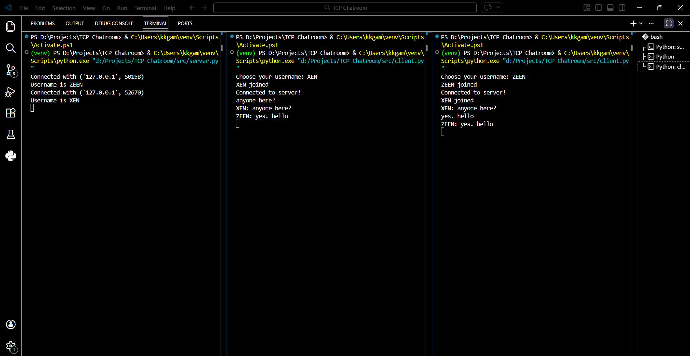
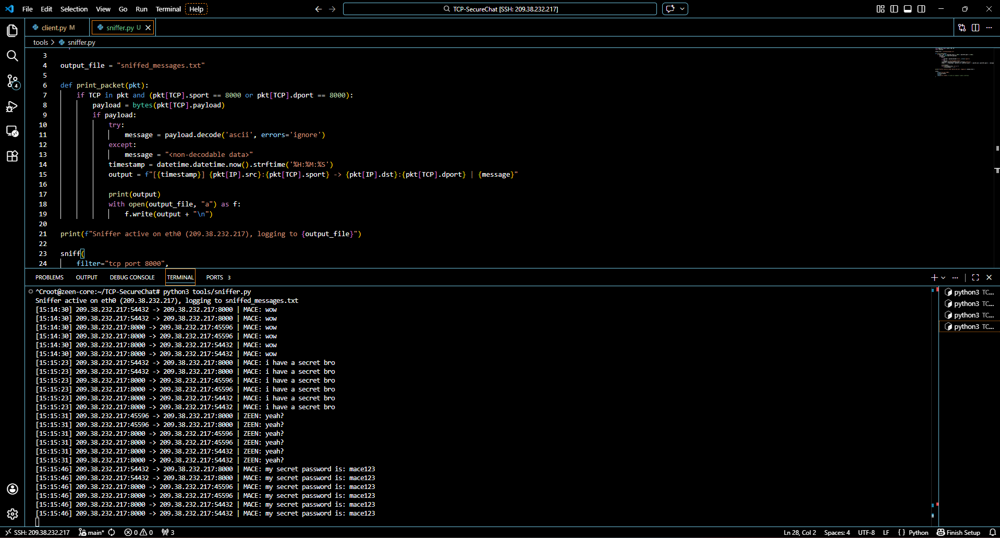
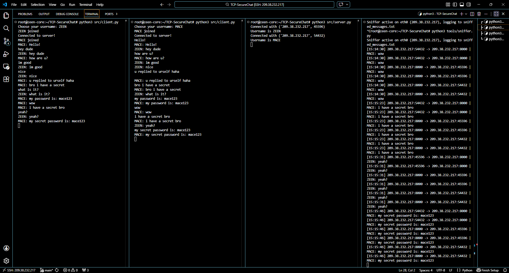

# TCP-SecureChat (DevSecOps Build)

## Phase 1 - TCP Chatroom (Foundation)

This is the first working iteration of the multi-threaded TCP chatroom. Messages currently travel in cleartext, which will be audited in Phase 2. 

### Overview Screenshot

Status: First iteration stable, all bugs fixed (threading, username encoding, socket reuse).  

Next step: Phase 2 — Build a packet sniffer to intercept TCP messages.

---

## Phase 2 - SEC I (Network Offensive & Defense)

**The Attack (Offensive):**  
Built a sniffer script (`tools/sniffer.py`) using `scapy` to capture TCP messages on port 8000.  

**Proof:**  
Screenshots and captured packets below show messages sent by clients being intercepted on the server’s network interface (`eth0`).

### Proof-of-Concept Screenshots
  

   

**Defense (Next Step):**  
Implement TLS/SSL encryption using Python’s `ssl` module to secure communication and mitigate MitM/sniffing attacks.

Status: Phase 2 offensive PoC complete. Sniffer logs successfully capture messages in transit.