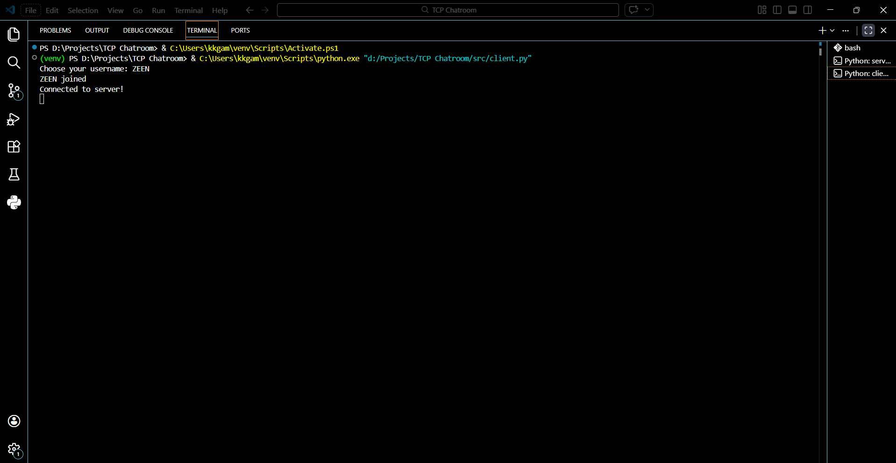
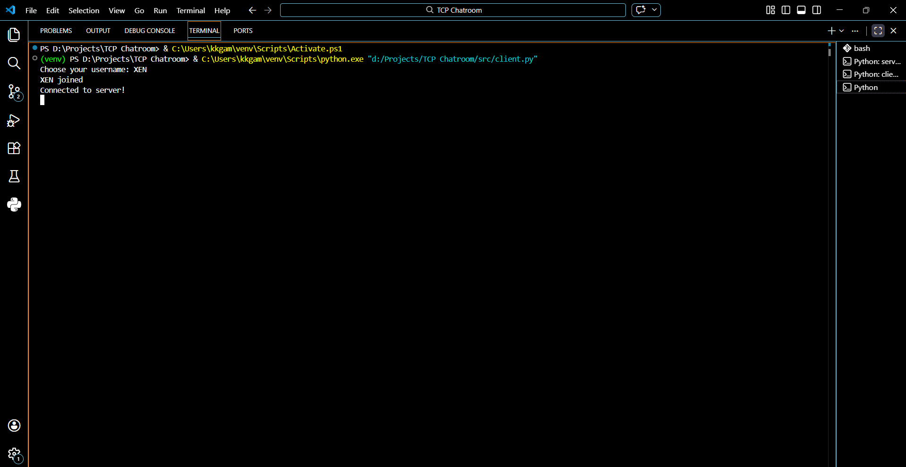
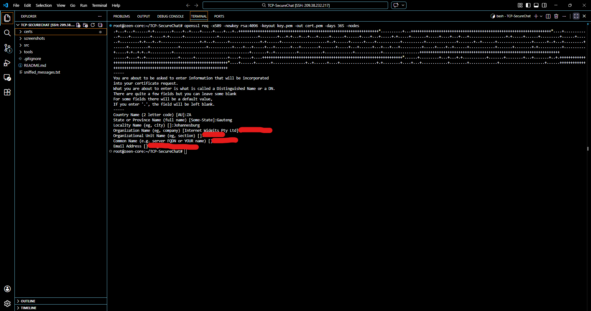
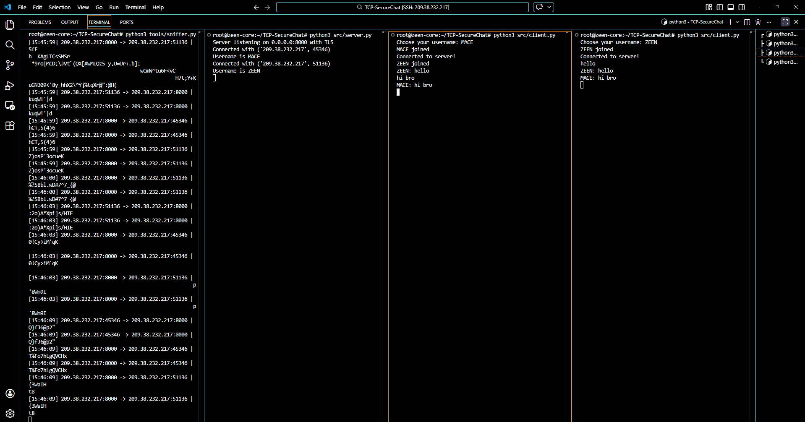
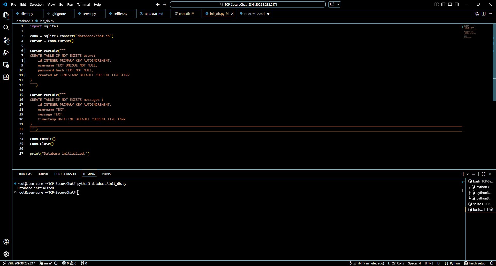
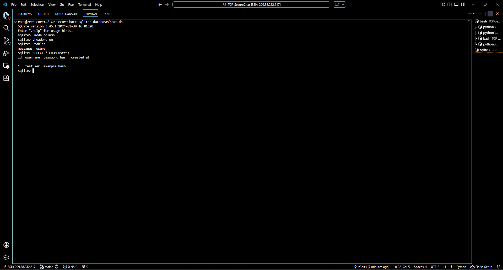

# TCP-SecureChat (DevSecOps Build)

A security-focused TCP chatroom built in Python to demonstrate **offensive network analysis and defensive security engineering**.

This project simulates a real-world DevSecOps workflow:

1. Build a working system
2. Attack the system to identify vulnerabilities
3. Implement security controls to mitigate the attack

The project is structured as a **progressive security lab**, where each phase introduces a new vulnerability and its corresponding defense.

## Phase 1 - TCP Chatroom (Foundation)

The first stage establishes a working multi-threaded TCP chat server where multiple clients can communicate simultaneously.

### Features:

* Multi-client socket server
* Thread-based client handling
* Username identification
* Broadcast messaging
* Stable connection management

Messages at this stage are transmitted in plaintext, intentionally leaving the system vulnerable for security analysis in Phase 2.

### Overview Screenshot





**Status:** 
First iteration stable, all bugs fixed (threading, username encoding, socket reuse).  

**Next Step:** 
Phase 2 - Build a packet sniffer to intercept TCP messages.

---

# Phase 2 - SEC I: Network Security Audit (Offensive)

To demonstrate the vulnerability of plaintext TCP communication, a **custom packet sniffer** was developed.

## The Attack (Offensive):

### Sniffer Tool

```
tools/sniffer.py
```

The tool uses **Scapy** to capture network packets traveling through the server interface.

The sniffer monitors:

```
TCP port 8000
```

Any messages sent between the chat clients and server can be intercepted and inspected.
 

Screenshots and captured packets below show messages sent by clients being intercepted on the server’s network interface (`eth0`).

### Proof-of-Concept Screenshots

The screenshots below demonstrate that messages transmitted by clients are visible on the network interface (`eth0`).

  

 

Captured messages are logged to:

```
sniffed_messages.txt
```

This confirms that the baseline chatroom sends **unencrypted plaintext traffic**, making it vulnerable to packet sniffing and potential Man-in-the-Middle attacks.

**Status:**
Offensive network analysis completed successfully.

**Defense (Next Step):**  
Implement TLS/SSL encryption using Python’s `ssl` module to secure communication and mitigate MitM/sniffing attacks.

# Phase 2 - SEC II Defensive Mitigation (TLS/SSL Encryption)

To protect against packet interception, **TLS encryption** was implemented using Python's `ssl` module.

This converts the insecure TCP channel into an **encrypted TLS communication channel**.

### Security Improvements

* TLS-wrapped server sockets
* Encrypted client-server communication
* Server certificate authentication
* Secure message transport

### TLS Certificates

Certificates are stored in:

```
certs/cert.pem
certs/key.pem
```

### TLS Implementation Example

```python
context = ssl.create_default_context(ssl.Purpose.CLIENT_AUTH)
context.load_cert_chain(certfile="certs/cert.pem", keyfile="certs/key.pem")
```

The server socket is wrapped with the TLS context before accepting client connections.

### TLS Verification

Certificate verification:



Packet capture after TLS implementation:



After encryption is enabled, the packet sniffer can still capture traffic, but **the message contents are no longer readable**.

This demonstrates the effectiveness of TLS as a **defensive control against network interception**.

**Status:**
Defensive mitigation successfully implemented.

**Next Step:** 
Phase 3 - Database Integration & Persistence > Implement an SQLite3 database to transition from volatile memory to persistent user accounts, enabling a secure registration and login system.

---

# Phase 3 - DEV II: Database Integration & Persistence

To transition the chatroom from a volatile in-memory system to a persistent application, **SQLite3** was integrated into the project.

This phase introduces **persistent user accounts** and lays the foundation for a secure registration and login system.

## The Build (Persistence Upgrade)

### Database Files

```
database/chat.db
database/init_db.py
```

The database initialization script creates the required tables for storing user accounts and chat messages.

### Database Tables

The following tables were created:

```
users
messages
```

### Users Table

The `users` table stores account credentials and creation timestamps.

Fields include:

* `id`
* `username`
* `password_hash`
* `created_at`

### Messages Table

The `messages` table stores chat history for future persistence support.

Fields include:

* `id`
* `username`
* `message`
* `timestamp`

### Database Initialization

The database schema is created by running:

```
python3 database/init_db.py
```

This generates the SQLite database file and creates the required tables.

### Proof-of-Concept Screenshots

Database initialization:



Database records verified through SQLite shell:



These screenshots confirm that the database tables were successfully created and that user records can be stored and queried.

### Authentication Protocol

Clients now communicate authentication requests to the server using the following format:

```
REGISTER|username|password
LOGIN|username|password
```

The server processes these requests and interacts with SQLite to either:

* create a new user account
* authenticate an existing user

### Password Security

Passwords are **never stored in plaintext**.

Before being inserted into the database, they are hashed using:

```python
hashlib.sha256()
```

This ensures that the database only stores hashed credentials.

---

**Status:**
SQLite database successfully integrated. Persistent user authentication infrastructure established.

**Next Step:**
Phase 4 - SEC III: Application Security Audit — attempt SQL Injection against the authentication flow, then mitigate it using parameterized queries and stronger password hashing.
